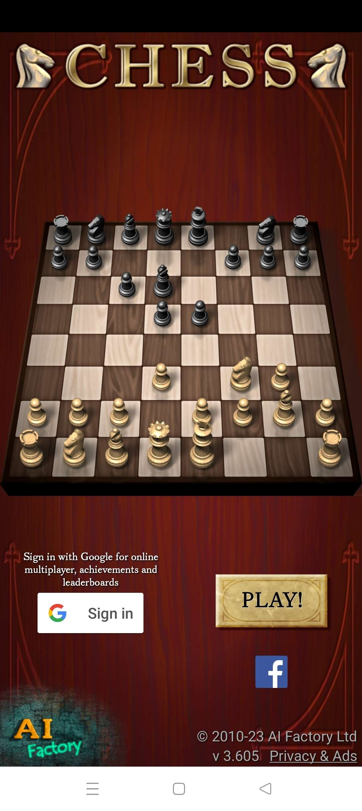
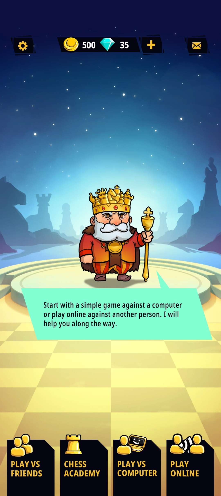

# Board Games (Chess) as Family Connection - Assignment 01

## Satsuki Liu - DGT HUM 110 @ UCLA, Spring '23

### Project Description
Though still preliminary, my hope for this UX project is to design a user experience targeting multiple generations of family members (ranging from children to grandparents), such that they will be able to experience "family connection" via means of spending quality time with each other. For my purposes, I will be attempting to present an intuitive and engaging UX for board games, specifically centered around chess as a medium for the aforementioned "family connection." There exist good applications for this purpose already, though in my research, some of them have feature bloat and rely upon systems that a grandparent might not find immediately intuitive. Thus, I have chosen two competitor apps for mobile chess to examine using Nielson's ten heuristics.

### Nielsen's Heuristics
Using the [NN/g](https://www.nngroup.com/articles/ten-usability-heuristics/) page as reference, the following table explains the ten heuristics created by Jakob Nielsen.

| #     | Name  | Description   |
| ---   | ---   | ---           |
| 1 | Visibility of system status | UI/UX should visibly display **what** is happening in a system in a quick and reasonable manner. |
| 2 | Match between system and the real world | UI/UX should match user's expectations of the **real-world**, speaking in plain terms rather than technical jargon, both textually and visually. |
| 3 | User control and freedom | UI/UX should empower users to amend mistakes and terminate processes in an easily identifiable manner (**undo** and **redo**). |
| 4 | Consistency and standards | UI/UX should conform to **existing industry standards** such that pre-existing common consumer language can be leveraged. |
| 5 | Error prevention | UI/UX should **preclude errors** where possible, being designed in a manner with preventation of such. |
| 6 | Recognition rather than recall | UI/UX should be **intuitive** through prompting, not being reliant on needing to remember the milieu of the application. |
| 7 | Flexibility and efficiency of use | UI/UX should have **redundancy** for its functions, such that different classes of users can use the application in varying levels of efficacy. |
| 8 | Aesthetic and minimalist design | UI's visuals should be focused on the **essentials** of the design rather than the frills. Function should be prioritized over form. |
| 9 | Help users recognize, diagnose, and recover from errors | UI/UX should provide an **easy diagnosis and solution** for errors as they occur, allowing users to fix any problems that arise. |
| 10 | Help and documentation | UI/UX should provide **help to the user** if they are lost. The documentation should be quickly accessible, easy to navigate, and concrete in its directions. |

The issues I find during this evaluation will be rated on a scale of 0 to 3, where 0 represents no issue at all and 3 represents a major impediment to using the application.

# App 1: [Chess (AI Factory)](https://play.google.com/store/apps/details?id=uk.co.aifactory.chessfree)

## Summary
[Chess](https://play.google.com/store/apps/details?id=uk.co.aifactory.chessfree) is a lightweight application designed for the express purpose of being a means of playing chess, either with two players on the same device or on two devices through the Internet. There is not much more to say in terms of describing its function, though my findings were that its UI was often unintuitive and its integration with Google Play Games was grating.

## Heuristic Evaluation
| Heuristic     | Summary  | Suggestions   | Severity |
| ---   | ---   | ---   | --- |
| Visibility of system status | When handling integration with Google Play accounts, it's not immediately apparent *which* account a user might be signed into, especially on the landing page and the main menu. In fact, the only screens on which a user can check which account is connected is on the Multiplayer tab. If a user has multiple Google accounts, or if multiple users share the same device, this oversight can be confusing and frustrating to deal with. | Rather than displaying the fact that a user is simply "signed in" on the landing page, connecting to Google's avatar API to display which account is currently connected to the application would be helpful. Furthermore, adding a widget for displaying the current Google account on the main menu would allow for a more sensible, easily-checkable way to monitor the system status. | 2 |
| Match between system and the real world | The icons used to configure CPU assistance during matches are very confusing to someone who isn't familiar with chess terminology and pre-established notions of the game, such as forks, pins, and skewers. The setting to display **"Pieces in Danger"** is represented by a pawn with the circular knob replaced with a red cartoon frown, **"Unsafe Moves"** is represented with a pawn next to an arrow superimposed with a frown, and **"Enhanced Unsafe Moves"** is represented by a network of four pawns, dashed arrows, and the same frown from before. This is not at all understandable to a layperson. | Though the application already has pop-ups for when the user first touches these icons that explain the features in greater detail, this only happens for the first selection and does not appear again. A simple way to fix this is to either get rid of the visual icons entirely and replace them with the text of their actual functions, or perhaps to allow users to check their names by tapping and holding the buttons and having the names hover above in a modal upon doing such. | 3 |
| User control and freedom | During matches, the ability to offer takebacks, as they are called in chess, is clearly defined using the universally recognized button for "undo". This is in accordance with both expectations and allows users to undo moves that they did not mean to make during a game. Whether or not this *should* be allowed in a game setting is questioanble, but it certainly is in accordance with user control. The main complaint I would have is that you cannot navigate from the main menu to the landing page without the built-in Android back button, which means this system would port over poorly to an Apple system. | Adding a home button to go back to the landing page from the main menu would fix this minor issue. | 1 |
| Consistency and standards | The actual layout of the chessboard and coordinate system used in algebraic chess notation conforms to standard FIDE layout, so the app does not err there, but I would categorize the layout of its dropdown menus during actual play as nothing short of atrocious. These buttons, on the top of the menu, are only accessible if one first hits a "Menu" button away from the board, which in turn brings up five icons, some of which are completely uninuitive for their function (an ideographic question mark for "Hint", a human hunched over a table for in-game options such as resignation, et al). | The options menu should be always accessible during a match, as the margin is already designated as blank space even during normal play. Furthermore, the icons could stand to be more intuitive and/or entirely replaced by a textual representation of their function. | 3 |
| Error prevention | Despite the aforementioned issues with being unclear with its icons, the application *does* have pop-ups for describing them, so if a user accidentally presses on an option that they do not want, this essentially functions as a confirmation screen. These, again, only appear once, however. | I would make these accessible arbitrarily such that the risk of a user forgetting which game options are which is lowered. | 1 |
| Recognition rather than recall | This is probably the app's greatest failure. I've already touched upon this in the "matching the system to the real world" heuristic, but the iconography used in the in-game layout is not intuitive. A user would have to remember that the question mark is for a Hint in the game, and *not* a help menu or documentation of some sort. The application's reliance on recall and user memory is too much to be tolerable. | I would change the icons to be simpler or less ambiguous (such as representing a hint button with clipart of a lightbulb, a standard in various puzzle games). | 3 |
| Flexibility and efficiency of use | This app is extensible and flexible for users of varying chess skill if they wanted to play a single-player match, as it allows them to use CPU assistance if they are beginners and to up the intelligence of the CPU opponent using stronger chess engines if so desired. Furthermore, in the multiplayer mode (which is more relevant to my evaluation), the CPU assistance can be enabled or disabled for either player, so in the event that a grandparent and a grandchild wished to play with each other, the assistance could be turned on for the younger, newer player. | N/A | 0 |
| Aesthetic and minimalist design | The UI layout is functional in terms of shapes and layouts, with most menu buttons being rectangular and filling the screen. My main complaint is that the app has a sort of skeumorphic design that introduces some readability difficulty for some screens, as the marbled effect of some of the buttons interferes with the darker text on some buttons. | Using either flat shading or a bevelled appearance would present a similar aesthetic "feel" to the app without impeding upon accessibility. | 1 | 
| Help users recognize, diagnose, and recover from errors | The main "errors" a user can encounter in this application are poor moves and blunders in the game of chess itself, and as covered in the section on user control, there is an intuitive UI for takebacks in a game. As such, this type of logical/gameplay error is well-handled and diagnosable, especially when considering the built-in analysis engine that explains the relative strength and dangers of certain game moves. | N/A | 0 |
| Help and documentation | Documentation is rather poor on this application, only being accessible from certain screens. Neither the landing page or the main menu has a clear tutorial or layout for how to use the app itself, and the way of accessing tools for game analysis and the like is frustratingly opaque from the in-game dropdown menu. There is, however, a **How To Play** submenu on the main menu that is essentially a basic chess playbook, and some pages link to it when referring to certain gambits such as skewers, but it is not easily accessible when it should be. | A button navigating to the **How To Play** guide should be included on more portions of the application, such as the game board, and should be denoted by either the same words or some recognizable icon such as a life preserver. | 2 |

## Conclusion
AI Factory's chess app is well-constructed from a gameplay perspective. For a free application, it is both lightweight and nonintrusive with its advertisements and layout, so it does not feel like it is overwhelming or claustrophobic to use. However, the UI is often frustratingly opaque and hard to understand, especially considering the icons chosen for given options and menus. For a multiplayer experience on a single device, however, it works perfectly fine if a family wants to play without any additional add-ons.

# App 2: [Chess Universe](https://chess-universe.net/)

## Summary
[Chess Universe](https://chess-universe.net/) is a chess app more in line with the design philosophy of a modern mobile game. There are microtransactions and chess puzzles presented as levels for progression. A lot of these features are vestigial to the purposes of my analysis, though I will still comment upon them from a heuristic perspective. This app's greatest strength is its friend system and a lack of need for third-party authentication.

## Heuristic Evaluation
| Heuristic     | Summary  | Suggestions   | Severity |
| ---   | ---   | ---   | --- |
| Visibility of system status | The chess board and status of the application are laid out well, both in terms of navigating the app and during actual gameplay. Friends list is consistently displayed in the social tab and is easy to verify. | N/A | 0 |
| Match between system and the real world | There is not much to comment on for this topic, as the application uses little technical jargon, even in its chess puzzles. Buttons are clearly lablelled with their function, and all settings tabs are denoted via a gear, which matches with expectations. | N/A | 0 |
| User control and freedom | A bit furstratingly, the chess game itself is rather "game-ified", with nonstandard game features such as the "shield" and "evaluation." If users wanted to play chess as-is without these features, they simply cannot. There is no option to turn these accessory features off, therefore providing a fundamentally different experience than many users would hope for. | There should be a version of chess in the game that is simply "vanilla chess" to allow for this sort of use. | 3 |
| Consistency and standards | The customizability of the difficulty of CPU opponents is serviceable, as it conforms to the ELO rating system from the values of 400 to 2400, presumably using some instance of Stockfish to inform the AI's move selection. Begrudingly, though still conforming to the stanards, was the use of coins as a common currency and diamonds as a premium currency, as these are in line with my experiences with other freemium games. However, other aspects of the app are not internally consistent, with confirmation buttons being labelled **GO**, **SURE**, **VISIT**, **OK**, and **YES** on the social media tab. | Standardizing these to conform with each other with a universal **OK** or **CONFIRM** would make the UX more cohesive and therefore in line with this heuristic. | 1 |
| Error prevention | In my experimentation with the application, no action I took went contrary to my expectations. Buttons led to intuitive sub-menus, accessing tutorials and settings menus was easy to do, and there was never a time in which I took an action that resulted in an error dialogue or otherwise unhandled behavior. | N/A | 0 |
| Recognition rather than recall | The icons used to represnt various features of the application, such as a gear for settings and an envelope for an inbox, were intuitive, and those that might not have been immediately obvious, such as the rook for the **CHESS ACADEMY**, were accompanied by textual labels that disambiguated any doubt I might have had. | N/A | 0 |
| Flexibility and efficiency of use | Customization for various types of CPU levels was both easy to access and easy to modify. Furthermore, the friend request system allowed for easy and quick access to the same users if a family would want to play matches with each other over the Internet without need of doing such through a randomized match selection. The only thing I would argue was detrimental to the flexibility of use was the inability to turn off game hints in local multiplayer. | As with the previous suggestions, an option to disable computer assistance in local multiplayer would alleviate a lot of the issue I have with this application. | 1 |
| Aesthetic and minimalist design | The aesthetic identity of this app is very clearly cartoony and game-y, so to speak. It is visually cohesive and not distracting, using blues and yellows throughout in a manner that is pleasing to the eye without drawing away from the important aspects of the UI, such as the function of buttons or navigability of the application. | N/A | 0 | 
| Help users recognize, diagnose, and recover from errors | The main "errors" a user can encounter in this application are poor moves and blunders in the game of chess itself, but this application has no option for takebacks in a casual setting. Unfortunately, this means that if there is an unintentional input, there is no way to deal with this issue. | The option to propose a takeback with a two-way verification, as is standard to many other chess apps, would fix this issue. | 2 |
| Help and documentation | The tutorial for how to navigate the app and learn chess are not repeatable. Accessing help menus is difficult when help menus don't exist in this app, after all. Furthermore, the currency systems are not immediately understandable to someone who has not played other mobile games that have microtransactions. | Adding a how-to-play guide for both chess and the application's navigation would improve this experience. | 2 |

## Conclusion
Chess Universe is well-designed from a functionality perspective, it just has feature bloat for the purposes of using the app as a vector for family connection. Ridding the app of these features, or at least providing the option to disable them, would mediate this issues. The other gamemodes such as Chess Academy actually serve as a good means for learning chess even if it may not further family connection in and of itself, and can in turn improve the experience of teenagers when playing against their more experienced parents or grandparents.