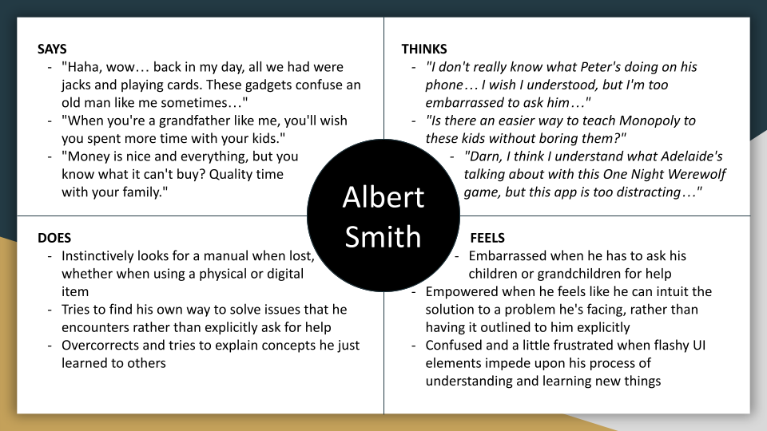

# DH110 - Assignment 04

## Satsuki Liu - DGT HUM 110 @ UCLA, Spring '23
This assignment is dedicated to exploring and applying UX storytelling for my project. The reason we are doing this assignment is to attempt to insert ourselves into the headspaces of potential users of our applications, and by doing such, we hope to engage user-centric design principles so that we can tailor the functions of our applications to better suit users' needs. Additionally, by attempting to put myself in some other persona's shoes, I am hoping that I can eliminate empathetic blindspots of mine so that I can effectively design a more global application.

## Personae and Empathy Maps
### Persona 1: Albert Smith - grandfather in love with the classics

#### Albert's Empathy Map

### Persona 2: Molly Chang - teenage board game aficionado

#### Molly's Empathy Map

## User Scenarios and Journey Maps
### Albert Smith's Scenario & Journey
#### Why?
As outlined prior, Albert is a retired man with four grandchildren and wants to make up for lost time in the past few decades in an attempt to connect to his family. The extended Smith family likes to host a family game night each Friday with both physical and digital games, so Albert is optimistic about his prospects. However, while he has his own shortlist of board games that he has enjoyed, including Backgammon, he feels lost whenever hsi grandchildren use their mobile phones to play newer games such as One Night Werewolf. He wants to learn how to use this app so that his technological barrier does not impede upon his learning of the board games.
#### How?
Half an hour before the Smith family game night, Albert downloads the application so that he can get a headstart on tonight's game. He is able to register for a new account using his email and the user interface for that is straightforward and intuitive enough, even for him. Rather than entering a compendium of games and selecting an option from a tile content list, he presses the question mark icon in the top left that explains the app's navigation to him in tutorial form. It explains what menu does what to him in plain English, and through some trial and error, he's able to learn how to navigate the app more effectively. The app offers to show him an example setup of a game of chess, and he follows the steps that allow him to set up a game against a CPU opponent. Satisfied with his understanding of the app's internals, he navigates to the One Night Werewolf game selection, where he is able to more effectively learn the game's rules now that the app's functionality is more intuitive to him. It even provides specific game scenario examples that visually demonstrate to him how certain gamestates work logically. Later that night, he is able to seamlessly connect to his grandchildren's game session using the app and the night is much better for him.
#### Journey Map

### Molly Chang's Scenario & Journey
#### Why?
Molly wants an easy way to play board games with her family when she visits them on the weekend, because while she loves simply talking to them, sometimes the small talk gets stale, and she's eager to connect with them in a way that's familiar to her. It's a hassle to bring physical board games to and from campus and her parents' home, so she prefers to use a mobile application for means of portability and universality. Plus, built-in tutorials in the app helps take off some of the load for her.
#### How?
Molly isn't sure what game she wants to play with her aunts today, so she opens the application and enters the game browsing menu. She filters out the games by a recommended number of players, with her query today being limited to four. She sees that among her options, Hong Kong mahjong fits the bill, and a standard game is stated to take around two hours, which is perfect for her purposes. She reviews the rules attached to the game, and when she feels familiar enough with them, she loads into the instance of the game and generates an invite link to download the app, which she texts to her three aunts. Once downloaded, the application redirects her aunts directly into the instance of the game, where the four of them are able to play the game together. As gameplay progresses, Molly is able to use a dropdown help menu to cross-reference the manual for both the rules of mahjong and how the controls of the application work, in order to clarify her own understnading and explain away any obstacles her aunts might have when it comes to using the application.
#### Journey Map
