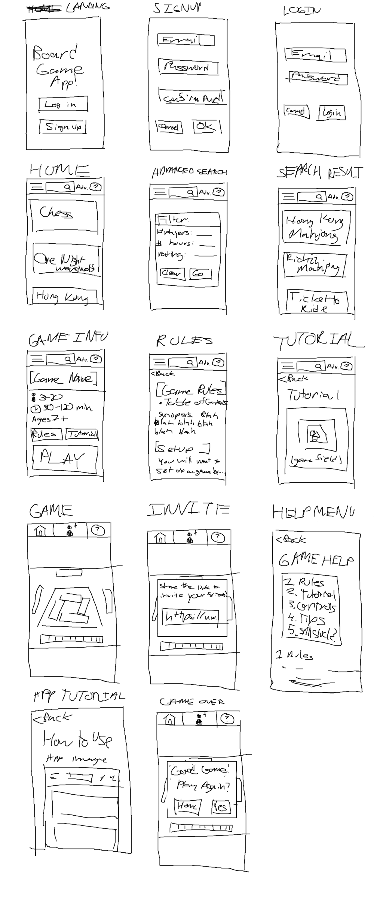
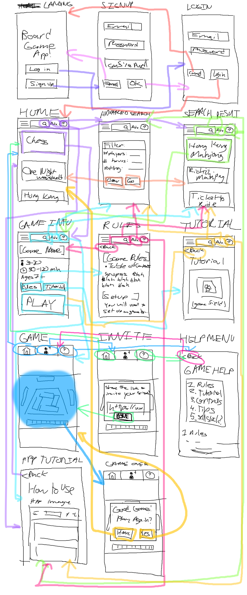
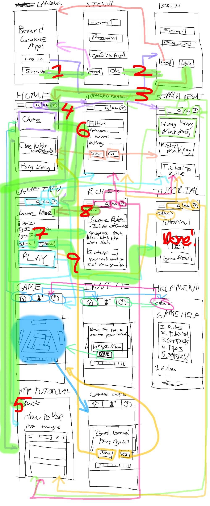
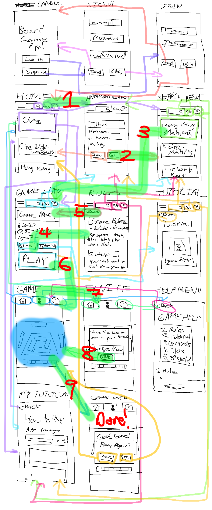

# DH110 - Assignment 05

## Satsuki Liu - DGT HUM 110 @ UCLA, Spring '23
This assignment is dedicated to designing a low-fidelity prototype for my project.

Prior assignments have been dedicated to user research, persona development, and usage scenarios for the board game application I am creating a mock-up for. Currently, my research finds that a major obstacle in playing board games with others, especially across a transgenerational barrier, largely comes down to the difficulty of explaining and teaching others how to play board games. Thus, the application I wish to design would enable users to play board games digitally, but my UI/UX is not focused on the gameplay of games, obviously. Rather, I want to design an application that allows users to easily learn and share their board game experience with others with as little overhead as possible.

The two personae I developed last assignment were 1. an elderly grandfather who is hampered by his technological illiteracy when it comes to playing board games with his younger family members, and 2. a young adult board game aficionado who finds frustration in trying to find a set of board games that has mass appeal for her older relatives while also being easy to explain. The two tasks I want to examine, therefore, are 1. learning the rules of a board game when being completely new to an application, and 2. finding a board game suitable for a given scenario and sharing the invitation link to play with relatives.

Lastly, the reason we are eve doing this is because lo-fi prototyping is a quick, easy, and low-cost method of testing out a proposed product before fully pouring time and resources into actually developing it. It allows us to catch user error early on and more generally, obtain user feedback before mistakes compound and become more expensive down the line. Catching flaws earlier on in the design process will prevent future headaches, more or less.

## Wireframes

## Wireflow

### Wireflow for Task 1

### Wireflow for Task 2

## Testing
Due to inclement circumstances in my life (sickness, mental health crisis), I did not conduct any user testing. My apologies.

## Reflection
Ignoring my abject lack of punctuality in turning in this assignment, this process was rather difficult, much more than I had anticipated. Specifically, many actions that I had described in plain English in the previous assignment proved to be very multifaceted and complicated, much more than I could have thought. A lot of wireframes I present in this assignment can be further broken down into various other steps, a process which I will likely document in Assignment 6 when I finally get around to it. Additionally, I should test that portion of the project with my roommates/friends ahead of time instead of waiting for a while. But then again, I'm sick right now with extremely low energy, so I'm trying my best.