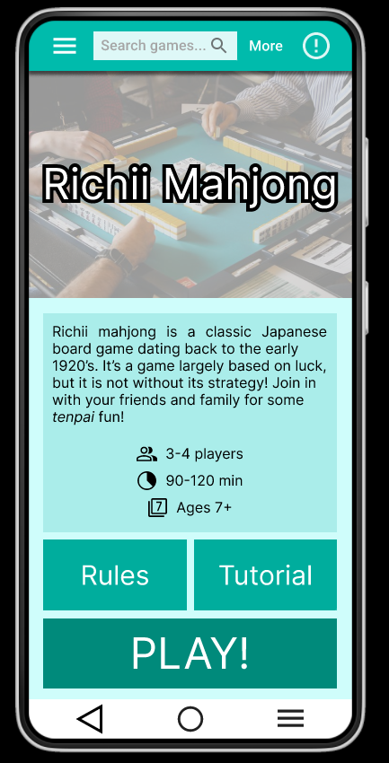
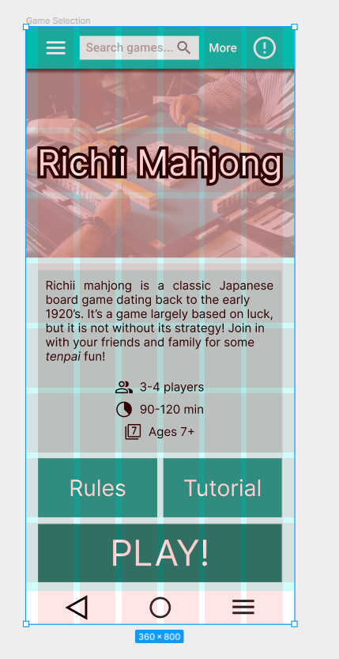
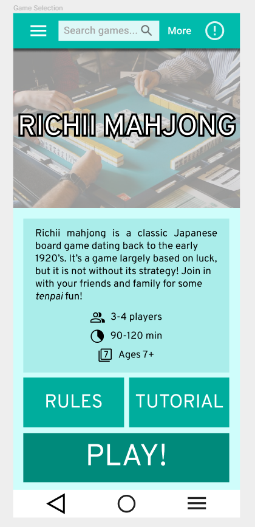
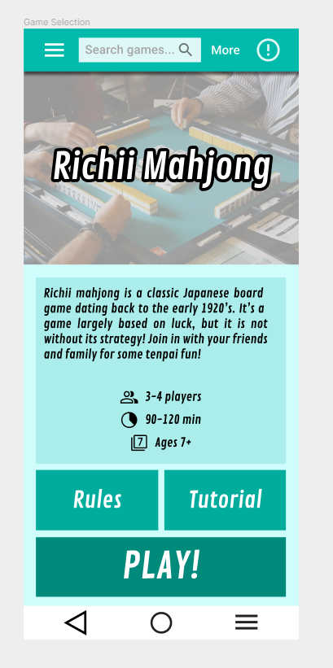
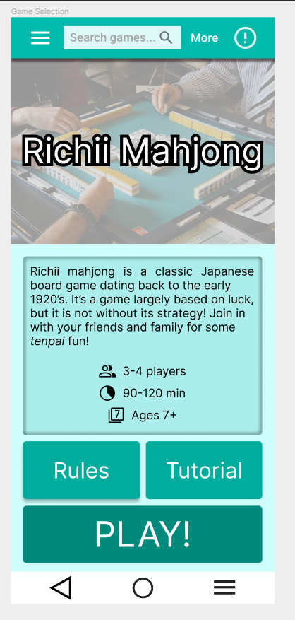
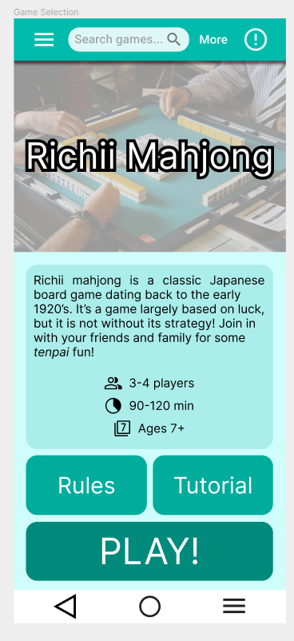
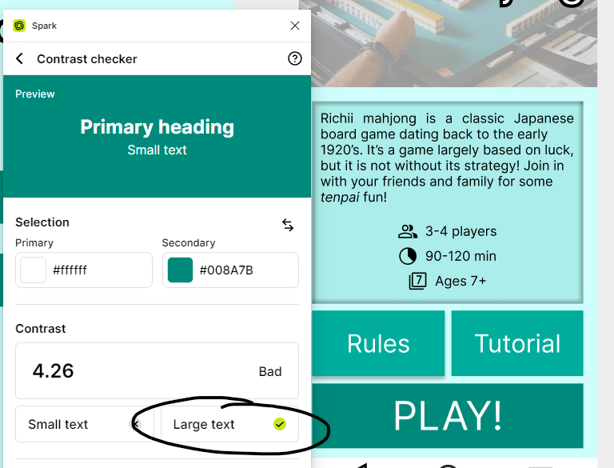
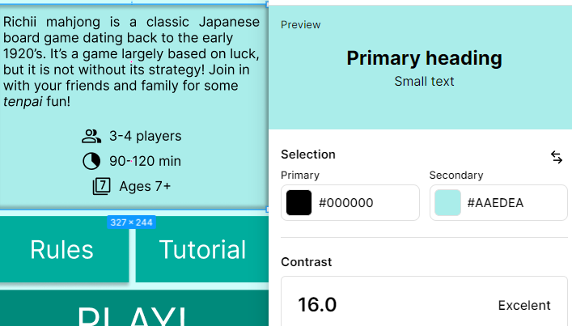
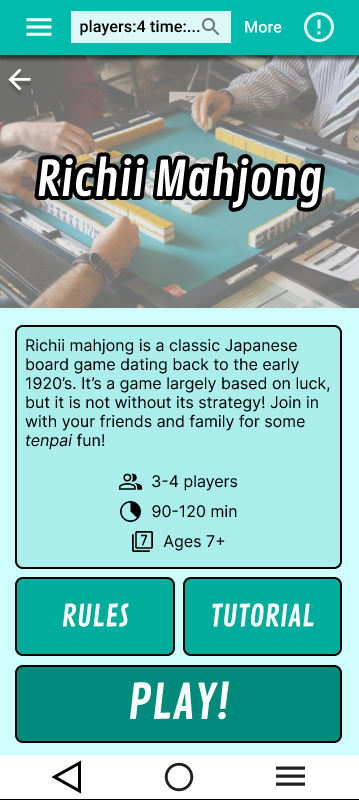

# DH110 - Assignment 06

## Satsuki Liu - DGT HUM 110 @ UCLA, Spring '23
This assignment is dedicated to designing the UI and layout of my project.

## Description
Through personal experience, anecdotal evidence, and user research, I have conjectured, and consequently verified, that a common activity that families use to connect with each other is playing board games. However, whether in-person or over the Internet, common pitfalls in gameplay often come down to difficulty explaining the rules of the game or inability to interface with real-world analogues. Thus, my proposed application seeks to provide users with an intuitive user interface that should make it easy for users of all ages to search up and access various board games, as well as play them, which I will not be extensively modelling but nonetheless demonstrating a severely limited mockup.

The main tasks I wish for users to achieve in this application are:
1. to have an intuitive and easy reference for finding rules of a board game, and
2. to have a convenient, one-stop shop for starting and sharing an online board game session.

This application will be helpful for both elderly family members who are unfamiliar with new digital interfaces through the former task, and it will be helpful to younger users who wish to save time in setting up board game sessions in alternative applications that are less intuitive to use for their older family members.

Drawing upon my extremely rough draft in Assignment 05, I digitized some of my wireframes in anticipation of building a high-fidelity prototype, which I did simultaneously with this assignment due to time constraints on my part. Layout and testing was done on Figma, and an impression test was conducted with a friend of mine. This process is vital to the UI design and prototyping process, as incorporating feedback from potential users is invaluable to UX as a process, as the developer may have both aesthetic and cognitive blindspots that can only be redressed through testing.

## Figma File
[Here](https://www.figma.com/file/MmlQK8HKhxU5z8IVgiOM92/Untitled?type=design&node-id=0%3A1&t=4M3dpuIjffMgMOWg-1) is the Figma file in which I did my work. The digitized wireflow can be found in the Prototype page, as I did this assignment simultaneously with Assignment 07.

## Selected Wireframe

## Design Process
I intentionally misaligned the metadata with the image because the gutter spacing looked weird.

### Typographic variation
This option uses Inter as its primary font for all text fields.

This option uses Overpass as its font for all options, and tests an all-CAPS overlay on most fields.

This option uses Contrail One for all of its text fields.

### Shape variation
This option uses sharp edges on all of its fields (no border radius).

This option uses a border radius of 4 pixels, and additionally tests a beveled appearance on the main text field.

This option tests an extreme border radius of 16 pixels.

### WCAG contrast

## Testing
Simultaneous with the Hi-Fi prototype assignment, I ran an impression test with a friend of mine as I was finalizing application flow. The recording of that can be found [here](https://youtu.be/NamijWmKfZk). She commented first on my selected wireframe in a five-second impression test, then I asked her to compare and contrast various color schemes, typographical layouts, and shape choices.

I summarize her comments as follows:
- The five-second impression test of the selected wireframe had a "cute" colorscheme, which is in-line with the sort of application I want to provide users, as this application strives to achieve a combination of a referential and recreational purposes. She critiqued the layout of the buttons, as the stark default layout did not exude professionalism.
- From a glance, she was able to tell the intent of the application as a compendium for board games to enable both game play and reference.
- She preferred the dark mode option primarily due to the bordered nature of UI elements, which she explained as having a greater contrast than the default light mode.
- She expressed a preference for the all-CAPS versions of the buttons, as she felt they were more cohesive than the original option.
- She expressed a preference for the Contrail One font, as it felt more playful than Inter and Overpass. She deemed this as more thematically in-line with the goal of the application.
- The rounded corners elicited a better response than the default rectangles, as the latter gave an impression of an unfinished product.

I incorporated her comments and made various adjustments to the layout by adding borders, changing the font to Contrail One, and making the buttons be in all capital letters.

## References
Material Design, for their link to the [icons](https://fonts.google.com/icons), their [color palette picker](https://m2.material.io/design/color/the-color-system.html#tools-for-picking-colors), and their [component kit](https://www.figma.com/@materialdesign).

## Design system recap
For the color scheme, I selected a muted aquamarine mostly on a whim, and based on impression testing, I have decided to stick with it due to its vibrant, fun feeling. The primary color used was #CFFDFB for the background, with #AAEDEA, #00AD9D, and #008A7B used as progressively darker shades of this hue, according to Material Design's calculator.

I have chosen a largely blocky presentation for the UI because it is both simple and intuitive, as well as thematically in-line with the purpose of the project: board games, which are often arranged in gridlike fashions. Buttons and menus have border radii of 8px wherever possible, and all headers and UI elements use the Contrail One font. Paragraphs use the default Figma font, Inter, at a font size of 16px. Headers range from 24px to 40px depending on the menu, and can be checked in the prototype document. All buttons are presented in 30px, with the exception of the PLAY! button, which is 48px. The search bar is also presented in 16px.

Gutters are 16px whenever possible, with slight manual adjustments whenever there is an odd UI element. Nested elements follow this principle.