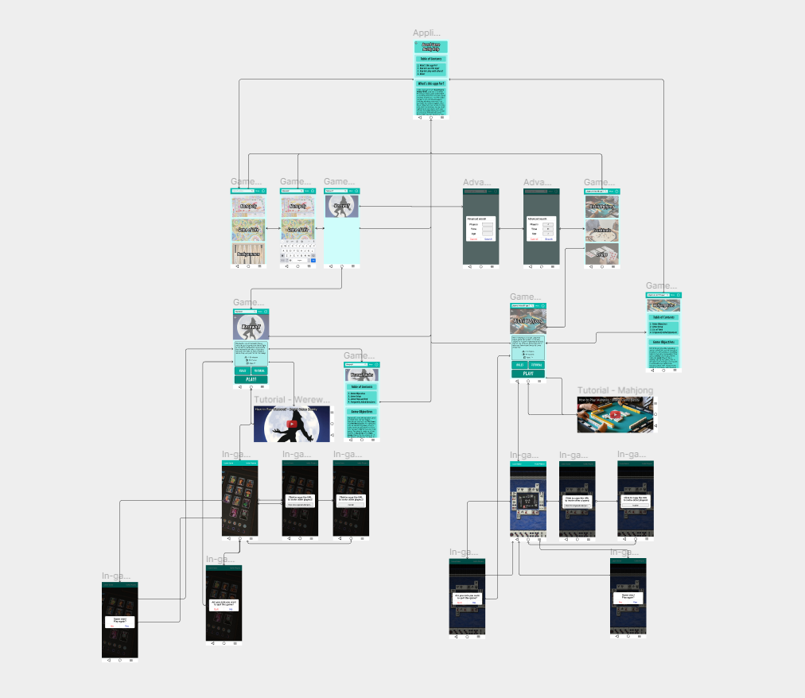

# DH110 - Assignment 07

## Satsuki Liu - DGT HUM 110 @ UCLA, Spring '23
This assignment is dedicated to the high-fidelty prototype of my project.

## Description
A high-fidelity prototype is a mockup of a website or application (or user experience in general) that translates the layouts and designs presented in a lo-fi prototype. It is interactive and is designed to emulate what it would really feel like to use the application/website in question. In the near-end of this project, this serves to finalize and test how robust/intuitive the design really is: through cognitive walkthroughs and other user testing, we can catch the final lingering issues we have and amend them accordingly.

I have dubbed my project this quarter "Board Game Buddy," as it is a mobile application that is designed as a one-stop shop for board game reference and gameplay. Based on prior research, younger players often have difficulty in explaining the rules of a game to others, so having a centralized, compiled app for various board game rules with visual tutorials attached should alleviate that sort of issue. Additionally, pre-existing solutions are desktop-only, so having an application in which a library of games can be easily accessed, shared with others, and then played would serve as a boon to users.

The main tasks I wish for users to achieve in this application are:
1. look up a pre-existing game (Werewolf, in our example) and familiarize oneself with the ruleset.
2. find a game based on selection criteria for a given crowd (four players, at least 90 minutes, and ages 7+, in our example), then share and play it with others.

I have not included the entirety of the rulesets and hypothetical tutorial videos for these games, as that is outside the scope of this project. Additionally, I did not design actual gameplay, as that does not target our goal of testing user experience, and is more under the scope of game design than anything else.

## Wireflow
The example wireflow of my project can be found below. A higher resolution can be found at the original document, [here](https://www.figma.com/file/MmlQK8HKhxU5z8IVgiOM92/Satsuki-Liu---Board-Game-Buddy?type=design&node-id=87-3574).

## Prototype
The high-fidelity prototype itself can be found [here](https://www.figma.com/proto/MmlQK8HKhxU5z8IVgiOM92/Satsuki-Liu---Board-Game-Buddy?type=design&node-id=39-32&scaling=min-zoom&page-id=2%3A10&starting-point-node-id=39%3A32).

## Cognitive Walkthrough
I was absent on the day we did in-class cognitive walkthroughs, and I don't have access to the form at the moment, so this section is currently blank. However, I do have a few comments from other students on the document itself. Most of them have to do with the fact that I had an unfinished prototype at the time of review, but Yun-Pu had helpful comments regarding some layout and formatting issues I had, such as the fact that I had justified text on one line instead of left-aligned like the others. I hope to get access to more data in the very near future, especially now that I am finally caught up with the assignments and can work on this simultaneously with the portfolio pitch.

What I know I can change right now is adding a social system to the application, allowing the persistence of friends so that users would not have to close to app, copy the invite link, and share it with others through a third-party application such as an SMS text messaging app or other texting application. Furthermore, I forwent actually designing the log-in and authentication screens, as I felt their inclusion was redundant and would not have actually demonstrated any of the skills I learned in this class.
